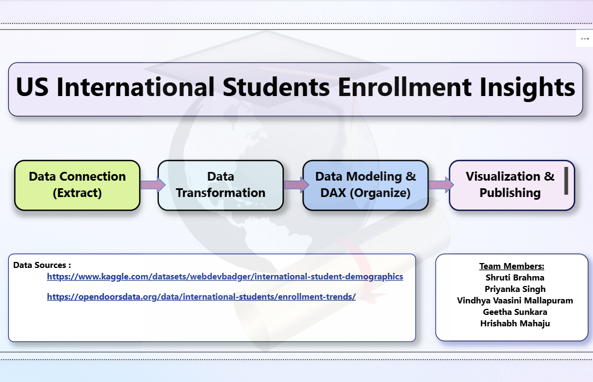
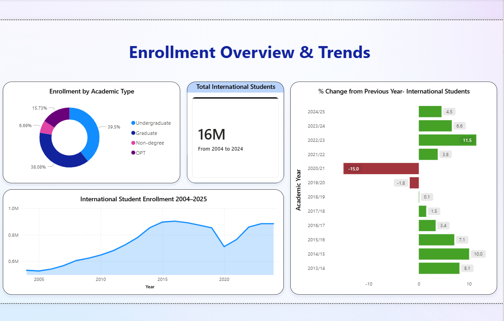
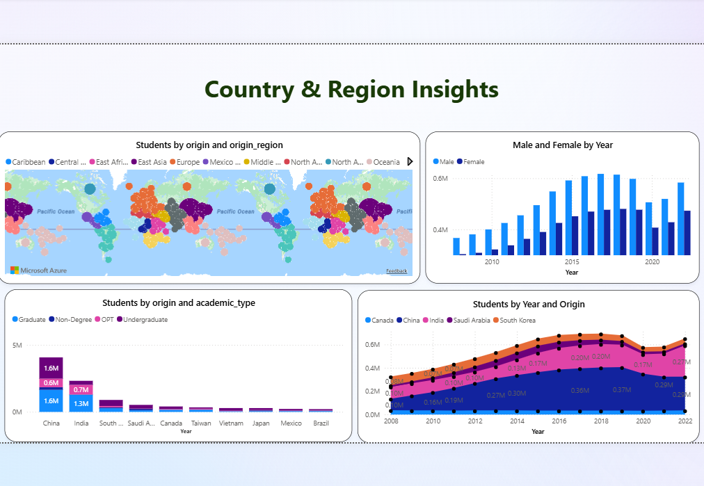
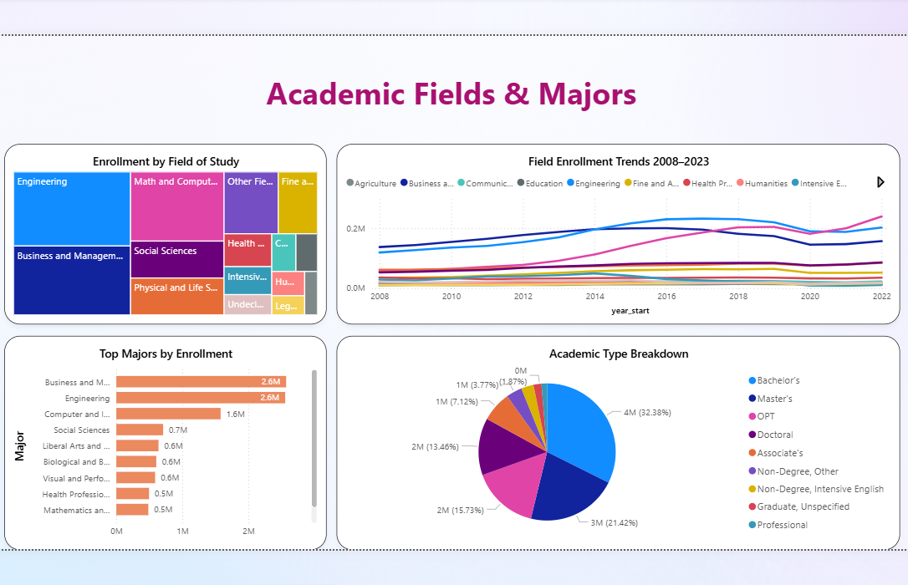
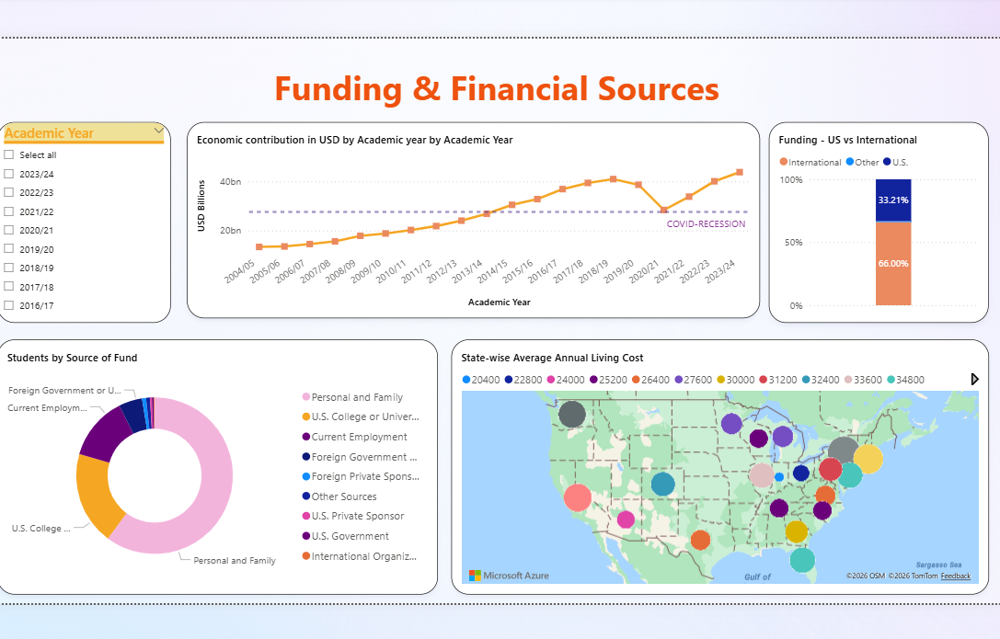

# 🎓 US International Student Enrollment Insights


A comprehensive Power BI dashboard analyzing **20 years of international student enrollment trends** across the United States — covering demographics, academic fields, funding sources, and regional origins.

---

## 📌 Project Overview

This project was developed as part of a graduate-level data analytics course. It dives into the trends and demographics shaping international student enrollment across U.S. institutions, transforming six raw CSV files into an interactive, insight-driven dashboard.

> **The key question this dashboard answers:** *Where do international students come from, what do they study, how do they pay for it — and how has that changed over time?*

---

## 👥 Team Members

| Name |
|------|
| Shruti Brahma |
| Priyanka Singh |
| Vindhya Vaasini Mallapuram |
| Geetha Sunkara |
| Hrishabh Mahaju |

---

## 📂 Data Sources

| Source | Description |
|--------|-------------|
| [Kaggle – International Student Demographics](https://www.kaggle.com/datasets/webdevbadger/international-student-demographics) | Demographics and enrollment data by country, gender, and field of study |
| [Open Doors Data](https://opendoorsdata.org/) | Longitudinal enrollment trends across U.S. institutions |

---

## 🔧 Analytics Pipeline

The project followed a structured four-stage pipeline:

```
Data Connection & Extraction  →  Data Transformation  →  Data Modeling & DAX  →  Visualization & Publishing
```

1. **Data Connection & Extraction** — Pulled data from Kaggle and Open Doors, covering international student demographics and enrollment trends.
2. **Data Transformation** — Cleaned, filtered, and restructured raw data to make it analysis-ready.
3. **Data Modeling & DAX** — Built table relationships and created calculated measures using DAX in Power BI to surface meaningful metrics.
4. **Visualization & Publishing** — Designed interactive, easy-to-read dashboards that tell a clear story.

---

## 📊 Dashboard Pages

### 1. 🏠 Overview
A high-level summary of enrollment performance featuring:
- Key KPIs: total students, enrollment trends, and summary metrics
- Dynamic filters by **year**, **program of study**, and **student origin**
- Quick identification of enrollment increases or declines over time

---

### 2. 📈 Enrollment Trends
Focuses on enrollment behavior across time to support resource planning:
- Year-over-year trend analysis from 2008 to 2023
- Helps institutions forecast demand, plan faculty hiring, and optimize capacity
- Enables a shift from **reactive planning to proactive strategy**

---

### 3. 🌍 Country & Region Insights
Explores where international students come from and how origins shift over time:
- **Global map** showing student origin concentration (strong in Asia — China & India)
- **Gender enrollment trends** — both male and female enrollment have grown; female enrollment shows steady increase
- **Students by country and academic program** — China and India dominate graduate programs
- **Country trends over time** — China is the largest contributor; India shows strong recent growth; a dip around 2020 reflects pandemic-related disruptions

> 💡 **Key Insight:** International enrollment is highly concentrated. Universities can use this to focus recruitment efforts and build targeted partnerships.

---

### 4. 🎓 Academic Fields & Majors
Answers: *What are international students actually studying, and how has that changed over 15 years?*

- **Treemap** — Aggregate view across 15 years; Engineering and Business account for ~50% of total enrollment
- **Line Chart** — Engineering overtook Business as the top field by 2014; Computer Science shows the steepest growth — nearly tripling over 15 years
- **Bar Chart** — Computer Science, Electrical Engineering, and Mechanical Engineering consistently rank in the top 3
- **Donut Chart** — Master's degree students make up the largest share, indicating a graduate-heavy international population

> 💡 **Key Insight:** International student demand is concentrated, predictable, and growing in STEM — especially at the graduate level.

---

### 5. 💰 Funding & Financial Sources
Explores how international students finance their education:
- **~43%** of all international students rely entirely on **personal and family funds**
- U.S. college and university funding has been steadily growing over 20 years
- **Heatmap** shows funding source dominance by academic level:
  - Graduate students lean heavily on **institutional funding**
  - Undergraduates are almost entirely **self-funded**
- Interactive filters by academic type and year range

> 💡 **Key Insight:** Nearly half the international student population receives no institutional support — a critical signal for financial aid planning.

---

## 🔑 Key Takeaways

- International enrollment dipped around **2020** due to the global pandemic but has **bounced back stronger than ever**
- **Engineering, Business, and CS** dominate field preferences — and this trend is growing
- **China and India** are the largest source countries, with India showing accelerating growth
- Universities can use this dashboard to make **data-driven decisions** on recruitment, financial aid, and program offerings

---

## 🛠️ Tools & Technologies

| Tool | Purpose |
|------|---------|
| Power BI Desktop | Dashboard development and DAX modeling |
| Power BI Service | Publishing and sharing |
| DAX | Calculated measures and KPIs |
| Excel / CSV | Raw data preparation |

---

## 📁 Repository Contents

```
📦 US-International-Student-Enrollment-Insights
 ┣ 📊 dashboard.pbix          # Power BI dashboard file
 ┣ 📁 data/                   # Raw and cleaned datasets
 ┣ 📁 screenshots/            # Dashboard page screenshots
 ┗ 📄 README.md               # Project documentation
```

---

## 📸 Dashboard Screenshots

> *Add screenshots of each dashboard page here*

```markdown





```

---

## 🚀 How to Use

1. Download the `dashboard.pbix` file from this repository
2. Open it with [Power BI Desktop](https://powerbi.microsoft.com/desktop/) (free)
3. Use the filters on each page to explore the data interactively
4. Click on any visual element to cross-filter all other charts on the page

---

## 📬 Contact

Feel free to connect on [LinkedIn](https://linkedin.com) or reach out via GitHub Issues for questions or feedback.
